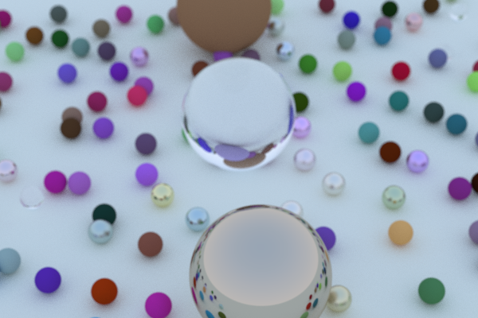
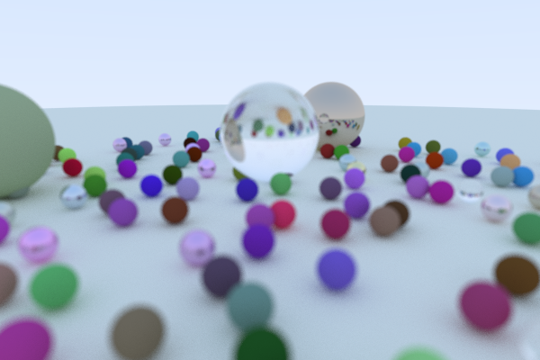
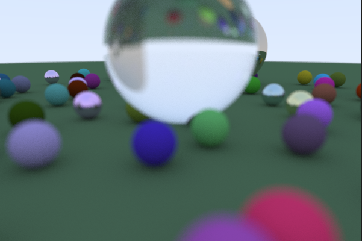

# Raytracing in one weekend
My implementation of [Peter Shirley's Ray Tracing in One Weekend](https://raytracing.github.io/books/RayTracingInOneWeekend.html) in C++.







This implementation covers:

* Simple raytracing involving spheres
* A positionable camera (look from and look at)
* Antialiasing
* Basic materials such as diffuse, metal and dielectrics
* Defocus Blur

## Running the program
```
$ build/inOneWeekend > image.ppm
```